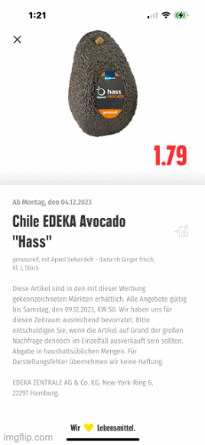
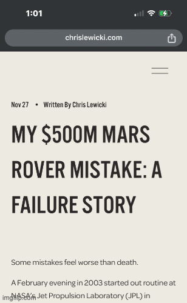
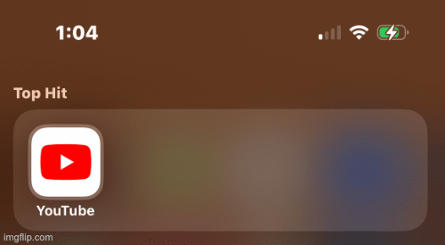

# ShortcutsGPT
### Awesome shortcuts using ChatGPT [&nbsp;&nbsp;&nbsp;](https://chat.openai.com/)
Using ChatGPT to supercharge your mobile workflows using iOS Shortcuts. This repo contains a list of automations that combine the power of some OpenAI's APIs like ChatGPT and Whisper, allowing you to do perform tasks like,

### Quick Summaries
- [**Ask ChatGPT from Screenshot**](#ask-chatgpt-from-screenshot-📱➡🤖) : Get text on Screen and summarize it using ChatGPT 
- [**Ask ChatGPT (from ShareSheet by URL)**](#ask-chatgpt-from-sharesheet-by-url-🌐➡🤖) Share a URL to directly share text and ask questions from ChatGPT
- [**Whisper Transcribe**](#whisper-transcribe-🎙️➡🤖) Share an Audio and get a summary/translation from ChatGPT
- [**Anti-Doom Scroll**](#anti-doom-scroll-📜❌) Roasts you when you open any app that you have configured in the shortcut.

## Shortcuts

1. ### Ask ChatGPT from Screenshot 📱➡🤖
**What does it do?**

This shortcut allows you extract text from any screen, translate it, summarize it and ask questions from it using ChatGPT.

**Pre-requisites**
- You need to have ChatGPT installed on your device

Here's how it works,
1. Take a screenshot of the text you want to summarize/translate/ask questions from.
2. Extracts the text from the screenshot using native iOS shortcut action
3. Asks what you need to do,
    - Translate : Translate the text to the specified language(English by default) and show it in *Quick Look*
    - Summarize : Summarize the text using ChatGPT and show it in *Quick Look*
    - Ask : Provides the full text to ChatGPT and let you ask questions from it in a continuous chat session. The shortcut will keep asking you for questions until you press *Cancel*.

It is especially useful for apps that don't let you copy/paste the text. You can also configure this shortcut to run when you tap the back of the phone using [BackTap on iPhone](https://support.apple.com/en-us/HT211781).

**How to use?**
- **iCloud Link** : [Ask ChatGPT from Screenshot](https://www.icloud.com/shortcuts/a0da9bb2b9d34759ac4f518f73409f73)
- **Shortcut File** : [Ask ChatGPT from Screenshot](./shortcuts/Ask%20ChatGPT%20from%20Screenshot.shortcut)

**Demo**

2. ### Ask ChatGPT (from ShareSheet by URL) 🌐➡🤖
**What does it do?**

This shortcut allows you to share any URL, from browser or any other app, extracts the text, translate it, summarize it and/or ask questions from it using ChatGPT.

**Pre-requisites**
- You need to have ChatGPT installed on your device

This shortcut is only visible when you press on the "Share" button. Here's how it works,
1. Takes the URL as input when you share it.
2. Extracts the text from URL using native iOS shortcut action

3. Asks what you need to do,
    - Translate : Translate the text to the specified language(English by default) and show it in *Quick Look*
    - Summarize : Summarize the text using ChatGPT and show it in *Quick Look*
    - Ask : Provides the full text to ChatGPT and let you ask questions from it in a continuous chat session. The shortcut will keep asking you for questions until you press *Cancel*.

**How to use?**
- **iCloud Link** : [Ask ChatGPT](https://www.icloud.com/shortcuts/1592879ceaef4be1ac03629886985abc)
- **Shortcut File** : [Ask ChatGPT from Screenshot](./shortcuts/Ask%20ChatGPT.shortcut)

**Demo**

3. ### Whisper transcribe 🎙️➡🤖
**What does it do?**
This shortcut allows you to share any audio file, from browser or any other app, extracts the text, translate and summarize it .

**Pre-requisites**
- You need to have an OpenAI API key. You can get one from [here](https://beta.openai.com/).
- You need to have ChatGPT installed on your device

This shortcut is only visible when you press on the "Share" button. Here's how it works,
1. Takes the audio file as input when you share it.
2. Extracts the text from audio using [Whisper](https://platform.openai.com/docs/guides/speech-to-text) API
3. Translates it and asks ChatGPT to summarize it and show it in *Quick Look*

**How to use?**
- **iCloud Link** : [Whisper Transcribe](https://www.icloud.com/shortcuts/9c6cf4976bc9475194b896dbcae540a3)
- **Shortcut File** : [Whisper Transcribe](./shortcuts/Whisper%20Transcribe.shortcut)

3. Asks what you need to do,
    - Translate : Translate the text to the specified language(English by default) and show it in *Quick Look*
    - Summarize : Summarize the text using ChatGPT and show it in *Quick Look*
    - Ask : Provides the full text to ChatGPT and let you ask questions from it in a continuous chat session. The shortcut will keep asking you for questions until you press *Cancel*.

**How to use?**
- **iCloud Link** : [Ask ChatGPT](https://www.icloud.com/shortcuts/1592879ceaef4be1ac03629886985abc)
- **Shortcut File** : [Ask ChatGPT from Screenshot](./shortcuts/Ask%20ChatGPT.shortcut)

**Demo**

4. ### Anti-Doom Scroll 📜❌
**What does it do?**

Roasts you when you open any app that you have configured in the shortcut. It is especially useful for apps like Twitter, Instagram, Facebook etc. that you want to use less.

**Pre-requisites**
- You need to have ChatGPT installed on your device

Here's how it works,
1. Gets the current time.
2. Asks ChatGPT to generate a random roast based on the time of the day for the given app you have configured.
3. Sends you an alert with the roast whenever you open the app.

**How to use?**

This shortcuts needs to be setup as an automation. Here's how you can do it,
1. Download the shortcuts from the links below.
2. Go to the automation tab in the Shortcuts app.
3. Create a new automation by clicking on the **+** button on the top-right corner.
4. Select "App" from the list.
5. Choose the App. Select **Is Opened** and **Run Immediately**. Then press **Next**.
6. Now choose the **Anti-Doom Scroll** shortcut from the list and press **Done**.

You will need to set it up separately for each app you want to use it for. You can configure the name of the app inside the shortcut.
- **iCloud Link** : [Anti-Doom Scroll](https://www.icloud.com/shortcuts/3c478f3cc676439fb442c6ab032078d8)
- **Shortcut File** : [Anti-Doom Scroll](./shortcuts/Anti-Doom%20Scroll.shortcut)

**Demo**

